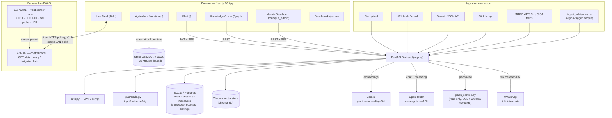
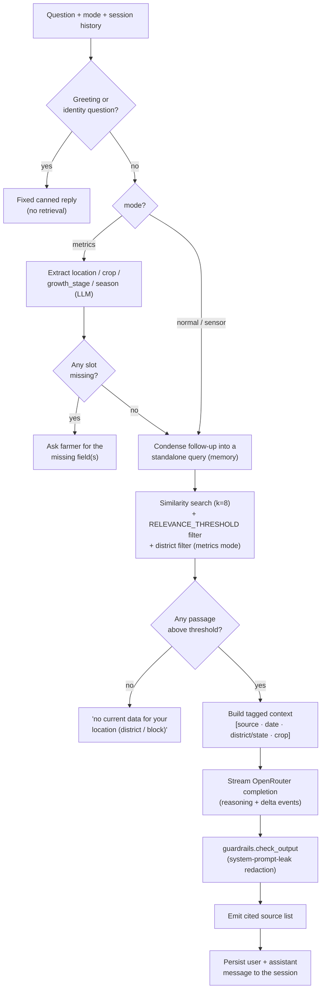

# RAG Uzhavan — Region-Aware Agricultural Intelligence Platform

A source-grounded RAG assistant for farmers that answers **only** from an indexed,
region-tagged corpus — state/university crop advisories, weather bulletins, mandi
(market) prices, soil reports — and refuses rather than guesses when nothing local
matches. Paired with a live IoT field-telemetry dashboard, an interactive India
agriculture map, a knowledge-graph explorer, and WhatsApp advisory dispatch, in
English and Tamil. Built with **FastAPI** (backend) and **Next.js 16** (frontend).

> Ask "when should I irrigate my Samba paddy in Thanjavur" and it answers from a
> Thanjavur-tagged advisory with dosage/date specifics quoted verbatim and the
> source named — or says plainly that it has no local data, rather than improvise.

## Features

- **Streaming, grounded chat** — token-by-token SSE, a live reasoning trace, a
  pipeline step trace ("Searching district data…", "Drafting answer…"), and a
  source strip under every answer. Three answer modes:
  - **normal** — generic grounded Q&A, no gate.
  - **metrics** — strict: requires location, crop, growth stage and season before
    it will answer; asks for whatever is missing; answers in a fixed
    **What to do / How much / Why / Source** framework with numbers copied
    verbatim from the source passage.
  - **sensor** — `normal` + the farmer's live field-sensor readings folded into
    the prompt, for timing questions ("should I irrigate now?").
- **Region-aware retrieval** — every question is filtered to the named district
  first; a passage tagged for another district is never used to answer. Refuses
  with a fixed "no current data for your location" message when nothing local
  matches — no general-knowledge fallback.
- **Short-term conversation memory** — the last few turns of a session are used
  to condense a follow-up ("how is it detected?") into a standalone query before
  retrieval, and are shown to the generator for a coherent reply. Degrades to "no
  memory" on any error.
- **Input/output guardrails** — deterministic prompt-injection/jailbreak
  pattern filters, an LLM misuse classifier, and output-side system-prompt-leak
  redaction. Every layer fails **open** (a guardrail error never blocks a real
  question) and is admin-toggleable at runtime.
- **Multi-channel knowledge ingestion**, all with live SSE progress in the admin
  dashboard:
  - **Upload** — PDF, DOCX, CSV, XLSX, JSON, LOG, TXT, MD
  - **URL** — fetch a page, crawl a whole site, or pull a structured record
    straight from the MITRE CVE Services API for a CVE link
  - **API** — generic JSON connector (endpoint + dotted JSON path + headers)
  - **GitHub** — download a repo tarball and index its docs / config / rule files
  - **Curated feeds** — MITRE ATT&CK (Enterprise), CISA KEV, CISA advisories RSS
  - **`ingest_advisories.py`** (CLI) — the purpose-built loader for the
    region-tagged agricultural advisory corpus: stamps state / district / crop /
    season / growth-stage / source / publication-date onto every chunk so
    retrieval can filter by region *before* running semantic search.

  > The URL/API/GitHub/feed connectors and the deterministic/LLM guardrail
  > classifier are inherited from an earlier build of this platform (a general
  > cyber-security research assistant); they still work and are exposed in the
  > admin dashboard, but only the file/URL uploader and `ingest_advisories.py`
  > are agriculture-specific.
- **Knowledge base admin dashboard** — every ingested source with a type badge,
  chunk count and origin; delete a source and its indexed chunks in one click;
  toggle guardrails on/off.
- **Knowledge Graph explorer** (`/graph`) — entities (advisory, crop, state,
  district, season, growth stage, publishing org, dataset) and their
  relationships, derived read-only from `knowledge_sources` + Chroma chunk
  metadata, rendered with Cytoscape.js + a force-directed (`fcose`) layout.
  Search, filter by facet, and expand an entity's neighborhood interactively.
- **India Agriculture Map** (`/map`) — a fully client-side Leaflet choropleth over
  ~28 MB of pre-baked state/district GeoJSON and per-district agri/rainfall/
  market/soil JSON. A normalization layer explicitly distinguishes "no data on
  file" from a genuine zero reading and classifies rainfall into IMD's official
  Large Excess → Large Deficient bands.
- **Live Field Telemetry** (`/field`) — the browser polls a farm ESP32 "control
  node" directly over the local Wi-Fi every ~2.5 s for temperature, humidity,
  tank water level and light status, and derives dryout/irrigation alerts
  client-side. A reading snapshot can be dropped straight into a chat question
  (sensor mode). See [IoT field hardware](#iot-field-hardware) below.
- **WhatsApp advisory dispatch** — turns any chat answer into a WhatsApp-formatted
  message and opens a `wa.me` click-to-chat link pre-filled with the full advisory,
  addressed to the farmer's saved (or entered) phone number. See
  [WhatsApp dispatch](#whatsapp-advisory-dispatch) below.
- **English + Tamil** — a language toggle switches every UI string via a small
  i18n context; farmer-facing copy is fully translated.
- **Auth & roles** — JWT auth, Student vs Admin accounts; only Admins can manage
  the knowledge base and runtime settings. A farmer profile (name, phone, state,
  district, primary crop) feeds region defaults and the WhatsApp number.
- **Benchmark scorecard** (`/score`) — a static snapshot of an offline grounding
  evaluation: 52 questions, 46 passed (88.5%) — 31 correctly answered from
  context, 15 correctly refused for having no local match.

### Known limitations

- **WhatsApp dispatch is click-to-chat, not push.** `whatsapp_service.py` builds
  a `wa.me` deep link and the frontend opens it — there is no Meta/Twilio
  messaging credential wired in, so the farmer's own device sends the message.
- **No cross-turn memory for retrieval routing decisions** — memory condenses the
  question text, but a "metrics"-mode slot (location/crop/stage/season) is
  re-extracted per turn from the condensed conversation, not carried as state.
- **`RETRIEVAL_V2`** (hybrid BM25 + dense fusion + rerank + a CRAG-style
  corrective retry, in `retrieval.py`) is a fully-built opt-in pipeline, off by
  default — the baseline path in `rag_pipeline.py` is what runs unless the env
  flag is set.
- The `/ask`, `/sessions/{id}/ask`, and `/upload` + `/files` endpoints are kept
  for backwards compatibility; use `/sessions/{id}/ask/stream` and the
  `/ingest/*` + `/sources` endpoints instead.
- CORS is wide open (`allow_origins=["*"]`) and `/register_admin` has no gate —
  both fine for a hackathon/demo deployment, worth locking down before any
  real-world rollout.

## Architecture



### RAG answer pipeline (`rag_answer_stream`)



## Tech stack

| | |
|---|---|
| **Backend** | FastAPI, LangChain + Chroma (retrieval), SQLAlchemy (SQLite locally / Postgres on Railway via `DATABASE_URL`), JWT (`python-jose` + `passlib[bcrypt]`), OpenRouter (`openai/gpt-oss-120b` for chat, reasoning, slot-extraction and the guardrail classifier), Gemini (`gemini-embedding-001`, 3072-dim, for embeddings), optional hybrid retrieval (`rank-bm25` + reciprocal rank fusion + rerank) |
| **Frontend** | Next.js 16 (App Router, Turbopack), React 19, TypeScript, Tailwind CSS v4 (custom design-token foundation), Leaflet (agriculture map), Cytoscape.js + `cytoscape-fcose` (knowledge graph), Framer Motion / `@lottiefiles/dotlottie-react` (motion) |
| **IoT** | Two ESP32 boards on the farm LAN — a field sensor node (DHT11, HC-SR04 ultrasonic, soil moisture, LDR) reporting to a control node that serves `GET /data` JSON directly to the browser and drives an irrigation relay |
| **Data** | A committed Chroma seed store (`Backend/chroma_db`, region-tagged advisory corpus) + ~28 MB of pre-baked India state/district GeoJSON and agri/rainfall/market/soil JSON (`frontend/public/data`) |
| **Deploy** | Backend on Railway (Nixpacks, persistent volume, seeds `chroma_db` into the volume on first boot); frontend on Vercel, pointed at the Railway API via `NEXT_PUBLIC_API_URL` |

## Prerequisites

- Python 3.10+
- Node.js 18+

## Setup

### 1. Backend

```bash
cd Backend
python -m venv venv
# Windows
.\venv\Scripts\activate
# Mac/Linux
source venv/bin/activate

pip install -r requirements.txt
```

Create `Backend/.env`:

```env
# Required
OPENROUTER_API_KEY=your_openrouter_key      # chat, reasoning, slot-extraction, guardrail classifier
GEMINI_API_KEY=your_gemini_key              # embeddings (gemini-embedding-001)
SECRET_KEY=change_me_to_a_random_secret     # JWT signing; insecure default if unset

# Optional
DATABASE_URL=postgresql://...               # Postgres in prod; SQLite (users.db) if unset
DATA_DIR=/path/to/persistent/volume         # where chroma_db / users.db live; defaults to cwd
LANGCHAIN_API_KEY=your_langsmith_key        # LangSmith tracing (safe to leave unset)
GUARDRAILS_ENABLED=true                     # master switch for the safety layer
GUARDRAIL_LLM_CHECK=true                    # run the LLM misuse classifier (~1 short call/request)
CONVERSATION_MEMORY_ENABLED=true
MEMORY_WINDOW=6                             # turns of session history used for memory
RELEVANCE_THRESHOLD=0.05                    # cosine-similarity floor for a retrieved chunk
RETRIEVAL_V2=false                          # opt-in hybrid/rerank/CRAG pipeline (see retrieval.py)
```

Run the server:

```bash
uvicorn app:app --reload --port 8000
```
*API runs at `http://localhost:8000`*

### 2. Frontend

```bash
cd frontend
npm install
```

Create `frontend/.env.local`:

```env
NEXT_PUBLIC_API_URL=http://localhost:8000
NEXT_PUBLIC_IOT_URL=http://<esp32-control-node-ip>   # optional; overridable at runtime in the UI
```

```bash
npm run dev
```
*App runs at `http://localhost:3000`*

## How to use

1. **Register** at `/register` (creates a Student account). Register an admin at
   `/ca_admin/reg`, then sign in at `/campus_admin/login`.
2. **Build the knowledge base (Admin)** — open `/campus_admin` and use any
   ingestion channel to grow the corpus, or run
   `python Backend/ingest_advisories.py <path/to/advisories_rag_ready.json>` to
   load the region-tagged agricultural corpus directly.
3. **Chat** — ask a question; the answer streams with a visible reasoning trace
   and cites the exact sources used. Switch to *metrics* mode for a strict,
   numbers-first answer, or capture live field readings first and ask in
   *sensor* mode.
4. **Explore** — `/graph` for the knowledge graph, `/map` for the district-level
   agriculture atlas, `/field` for live sensor telemetry.
5. **Send to WhatsApp** — from a chat answer, dispatch it as a formatted WhatsApp
   advisory to the farmer's saved number.

## IoT field hardware

Two ESP32 boards run on the farm's own Wi-Fi, independent of the RAG backend:

- **Field sensor node** — reads temperature/humidity (DHT11), tank water level
  (HC-SR04 ultrasonic), soil moisture, and ambient light (LDR), and reports to
  the control node.
- **Control node** — aggregates the latest reading and serves it as JSON at
  `GET /data`, and drives an irrigation relay with an on-device dryout lock.

The Next.js app (`frontend/src/lib/iot.ts`) polls the control node **directly**
from the browser every ~2.5 s (`useTelemetry`) — the RAG backend is never in this
path. The device responds with CORS + private-network headers so this works from
`http://localhost`; on the deployed HTTPS site the same call is blocked as mixed
content unless the viewer is on the farm's own LAN, which the UI surfaces as
"device unreachable" rather than a crash. The device IP is configurable at
runtime (stored in `localStorage`) since DHCP leases move.

Client-side alert ladder (`deriveAlerts`, mirrors the device's own decision
order): tank distance > 50 cm → **critical**, pump auto-blocked; > 40 cm →
**warning**; soil sensor reads LOW → **advisory**; plus high-temperature and
low-humidity advisories. The browser only displays these — it never actuates
the pump. A "Capture readings" action snapshots the live values so they can be
dropped into a chat question in *sensor* mode.

## WhatsApp advisory dispatch

`POST /sms/send-advisory` (aliased at `/whatsapp/send-advisory`, both under `/api/*`
too) takes the answer text and an optional phone number, and:

1. Strips markdown to clean WhatsApp-safe formatting (`whatsapp_service.py`).
2. Normalizes the phone number to international format (assumes India, `+91`,
   for a bare 10-digit number).
3. Persists the number onto the caller's farmer profile if it changed.
4. Returns a `wa.me` / `api.whatsapp.com` **click-to-chat** URL pre-filled with
   the full advisory — the frontend opens it (`window.open`) so the farmer's own
   WhatsApp client sends it. There is no push API credential involved; latency
   and payload-size figures in the response describe link generation, not actual
   message delivery.

## API reference

### Auth & profile
| Method | Endpoint | Description | Auth |
|---|---|---|---|
| `POST` | `/register` | Create a Student account | No |
| `POST` | `/register_admin` | Create an Admin account | No |
| `POST` | `/token` | Login, returns a JWT | No |
| `GET` | `/users/me` | Current user + profile fields | Yes |
| `PATCH` | `/users/me` | Update profile (name, phone, state, district, crop) | Yes |

### Chat
| Method | Endpoint | Description | Auth |
|---|---|---|---|
| `GET` | `/sessions` | List the current user's chat sessions | Yes |
| `POST` | `/sessions` | Create a new session | Yes |
| `GET` | `/sessions/{id}/messages` | Session history (incl. reasoning + sources) | Yes |
| `POST` | `/sessions/{id}/ask/stream` | Ask a question — SSE stream (steps, reasoning, sources, answer) | Yes |
| `DELETE` | `/sessions/{id}` | Delete a session (cascades messages) | Yes |

`QueryRequest` body: `{question, mode: "normal"\|"metrics"\|"sensor", sensors?}`.

### Knowledge ingestion (Admin)
| Method | Endpoint | Description |
|---|---|---|
| `POST` | `/ingest/file` | Upload one or more files — SSE progress |
| `POST` | `/ingest/url` | Fetch/crawl a web page (or a CVE link → structured record) |
| `POST` | `/ingest/api` | Pull records from a JSON API endpoint |
| `POST` | `/ingest/github` | Download and index a GitHub repo |
| `POST` | `/ingest/feed` | Import a curated feed (`mitre_attack`, `cisa_kev`, `cisa_advisories`) |

### Knowledge sources & graph
| Method | Endpoint | Description | Auth |
|---|---|---|---|
| `GET` | `/sources` | List ingested sources (with chunk counts) | Admin |
| `GET` | `/sources/graph` | Lightweight node list (legacy) | Yes |
| `DELETE` | `/sources/{id}` | Remove a source and its indexed chunks | Admin |
| `GET` | `/graph/full` | Full entity/relationship graph for the explorer | Yes |
| `GET` | `/graph/entities/{id}` | Single entity lookup | Yes |
| `GET` | `/graph/entities/{id}/neighbors` | 1- or 2-hop neighborhood (`depth`, `limit`) | Yes |
| `GET` | `/graph/search` | Search entities by text / type | Yes |

### Admin settings & advisory dispatch
| Method | Endpoint | Description | Auth |
|---|---|---|---|
| `GET` / `PATCH` | `/admin/settings` | Read/toggle `guardrails_enabled` | Admin |
| `POST` | `/sms/send-advisory` | Format + generate a WhatsApp click-to-chat link | Optional |

## Project structure

```
Backend/
  app.py                 # FastAPI routes (auth, chat, ingestion, sources, graph, WhatsApp)
  rag_pipeline.py         # Retrieval, prompts (normal/metrics/sensor), streaming generation,
                          #   memory/condensation, slot extraction, all ingestion connectors
  retrieval.py            # Opt-in hybrid retrieval (BM25 + dense RRF + rerank + CRAG), off by default
  guardrails.py           # Input pattern filters + LLM misuse classifier + output leak redaction
  graph_service.py        # Read-only entity/relationship graph builder for /graph/full
  auth.py                 # JWT issuing/verification, password hashing
  database.py              # SQLAlchemy models (User, ChatSession, ChatMessage, KnowledgeSource, Setting)
  whatsapp_service.py      # WhatsApp message formatting + wa.me deep-link generation
  sms_service.py           # Thin backward-compatible alias over whatsapp_service
  ingest_advisories.py     # CLI loader for the region-tagged advisory corpus
  re_embed.py              # Dev utility: copy Chroma into a new collection under a different embedder
  push_schema.py           # Dev utility: create/upgrade DB tables for the configured DATABASE_URL
  chroma_db/                # Committed seed vector store (copied onto the Railway volume on first boot)
frontend/
  src/app/                 # Routes: /, /home, /login, /register, /campus_admin(+/login), /ca_admin/reg,
                          #   /graph, /map, /agriculture-map, /field, /score
  src/components/           # ChatInterface, KnowledgeGraph, FieldTelemetry, SmsAdvisoryModal, Landing,
                          #   ProfileMenu, GlobalCinematicBackground
  src/components/admin/     # Ingestion panels (File/URL/API/GitHub/Feed), SourceList, GuardrailToggle
  src/components/map/       # AgricultureMap, IndiaMapCanvas, MapFilterBar, MapLegend, MapSidePanel
  src/components/primitives/  # Thinking trace, streaming markdown, sources, selection actions, code block
  src/i18n/                 # English + Tamil translations, language context/toggle
  src/lib/                  # API client, SSE readers (chat + ingestion), ESP32 telemetry client, map data adapter
  public/data/               # ~28 MB pre-baked India GeoJSON + agri/rainfall/market/soil JSON
```

## Troubleshooting

**`AttributeError: module 'bcrypt' has no attribute '__about__'`**
Already pinned in `requirements.txt` (`bcrypt<4.1.0`). If you still hit it, reinstall inside
your virtualenv: `pip install "bcrypt<4.1.0" --force-reinstall`.

**Chat answers fall back to a generic error instead of a real answer**
Check `OPENROUTER_API_KEY` and `GEMINI_API_KEY` are both valid. If a question has
no match in the knowledge base you'll get the fixed "no current data for your
location" message instead of an answer — that's expected; ingest a relevant
advisory or widen the corpus.

**Field telemetry shows "device unreachable"**
The browser must be on the same local Wi-Fi as the ESP32 control node — the
deployed HTTPS site cannot reach a plain-HTTP device on your LAN from outside
it (mixed-content block). Set the correct device IP in the Live Field page, or
run the frontend locally on the same network as the device.
