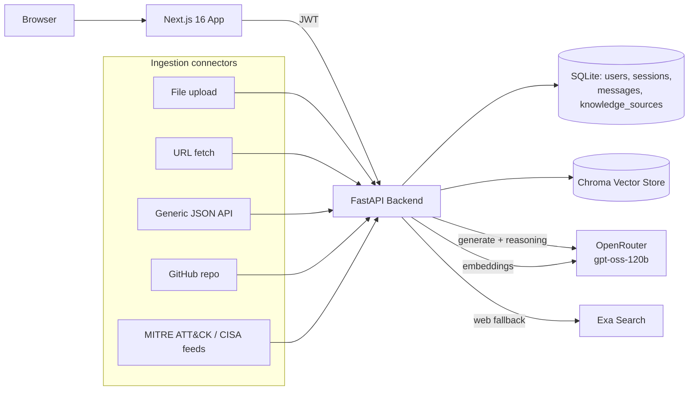

# Sentinel — Cyber Security Intelligence Assistant

A private, source-grounded RAG assistant for cyber security teams. Every answer is generated
only from a knowledge base you control — CVE reports, MITRE ATT&CK, vendor advisories,
IR playbooks, GitHub rule repos, logs, spreadsheets — and every claim is cited back to the
passage it came from. Built with **FastAPI** (backend) and **Next.js 16** (frontend).

> Not a general-purpose chatbot with security knowledge — a retrieval layer over *your*
> security knowledge, with every claim cited to the page.

## Features

- **Streaming, grounded chat** — real token-by-token SSE streaming, a live model-reasoning
  trace, a pipeline step trace ("Retrieved 4 passages…", "Drafting answer…"), and a
  compact source strip under every answer (doc page, web link, or feed entry).
- **Multi-channel knowledge ingestion**, all with live progress in the admin dashboard:
  - **Upload** — PDF, DOCX, CSV, XLSX, JSON, LOG, TXT, MD
  - **URL** — fetch and index any advisory / CVE / ATT&CK web page
  - **API** — generic JSON connector (endpoint + JSON path + optional headers)
  - **GitHub** — clone a repo and index its docs / detection rules
  - **Curated feeds** — one-click import of the MITRE ATT&CK Enterprise matrix, the CISA
    advisories feed, and the CISA Known Exploited Vulnerabilities (KEV) catalog
- **Knowledge base admin dashboard** — every ingested source listed with a type badge,
  chunk count, and origin; delete a source and its indexed chunks in one click.
- **Knowledge graph** (`/graph`, available to every signed-in user) — a force-directed
  visualization of every ingested source, grouped by type around a central hub. Drag,
  hover to highlight, recenter.
- **Selection actions** — highlight any answer text to Copy, Quote (pins the excerpt to
  your next question), or Explain it.
- **Session-based chat history** — per-user chat sessions, sidebar with search (`⌘K`).
- **Web search fallback** (via Exa) when nothing in the knowledge base matches a
  security-relevant question — degrades gracefully (no local match ≠ a broken response)
  if no Exa key is configured.
- **Auth & roles** — JWT auth, Student vs Admin accounts; only Admins can manage the
  knowledge base.

### Known limitations

- **No cross-turn conversation memory yet.** Each question is retrieved and answered in
  isolation — a follow-up like "how is it detected?" won't resolve "it" from the previous
  turn. Chat history is *stored* (you can reopen a session and read it) but not fed back
  into retrieval or generation. See `Backend/rag_pipeline.py` / `ask_rag_session_stream`.
- The `/ask`, `/sessions/{id}/ask`, and `/upload` + `/files` endpoints are kept for
  backwards compatibility; use `/sessions/{id}/ask/stream` and the `/ingest/*` + `/sources`
  endpoints instead.

## Architecture



## Tech stack

| | |
|---|---|
| **Backend** | FastAPI, LangChain + Chroma (retrieval), SQLAlchemy/SQLite, JWT (`python-jose`), OpenRouter (`openai/gpt-oss-120b` for chat + reasoning, `text-embedding-ada-002` for embeddings), Exa (web fallback) |
| **Frontend** | Next.js 16 (App Router, Turbopack), React 19, Tailwind CSS v4, TypeScript, Hanken Grotesk |

## Prerequisites

- Python 3.10+
- Node.js 18+

## Setup

### 1. Backend

```bash
cd Backend
python -m venv venv
# Windows
.\venv\Scripts\activate
# Mac/Linux
source venv/bin/activate

pip install -r requirements.txt
```

Create `Backend/.env`:

```env
# Required
OPENROUTER_API_KEY=your_openrouter_key      # chat model + embeddings
SECRET_KEY=change_me_to_a_random_secret     # JWT signing; insecure default if unset

# Optional
EXA_API_KEY=your_exa_key                    # web search fallback when the KB has no match
LANGCHAIN_API_KEY=your_langsmith_key        # LangSmith tracing (safe to leave unset)
```

Run the server:

```bash
uvicorn app:app --reload --port 8000
```
*API runs at `http://localhost:8000`*

### 2. Frontend

```bash
cd frontend
npm install
```

Create `frontend/.env.local`:

```env
NEXT_PUBLIC_API_URL=http://localhost:8000
```

```bash
npm run dev
```
*App runs at `http://localhost:3000`*

## How to use

1. **Register** at `/register` (creates a Student account). Register an admin at
   `/ca_admin/reg`, then sign in at `/campus_admin/login`.
2. **Build the knowledge base (Admin)** — open the admin dashboard and use any of the five
   ingestion channels (Upload / URL / API / GitHub / Feeds) to grow the corpus. Each shows
   live progress and lands as a row in the source list.
3. **Chat** — ask a question; the answer streams token-by-token with a visible reasoning
   trace and cites the exact sources it used.
4. **Explore** — open `/graph` to see every indexed source as a node, or select text in an
   answer to Copy / Quote / Explain it.

## API reference

### Auth
| Method | Endpoint | Description | Auth |
|---|---|---|---|
| `POST` | `/register` | Create a Student account | No |
| `POST` | `/register_admin` | Create an Admin account | No |
| `POST` | `/token` | Login, returns a JWT | No |
| `GET` | `/users/me` | Current user info | Yes |

### Chat
| Method | Endpoint | Description | Auth |
|---|---|---|---|
| `GET` | `/sessions` | List the current user's chat sessions | Yes |
| `POST` | `/sessions` | Create a new session | Yes |
| `GET` | `/sessions/{id}/messages` | Session history (incl. reasoning + sources) | Yes |
| `POST` | `/sessions/{id}/ask/stream` | Ask a question — SSE stream (steps, reasoning, sources, answer) | Yes |

### Knowledge ingestion (Admin)
| Method | Endpoint | Description |
|---|---|---|
| `POST` | `/ingest/file` | Upload one or more files — SSE progress |
| `POST` | `/ingest/url` | Fetch and index a web page |
| `POST` | `/ingest/api` | Pull records from a JSON API endpoint |
| `POST` | `/ingest/github` | Clone and index a GitHub repo |
| `POST` | `/ingest/feed` | Import a curated feed (`mitre_attack`, `cisa_advisories`, `cisa_kev`) |

### Knowledge sources
| Method | Endpoint | Description | Auth |
|---|---|---|---|
| `GET` | `/sources` | List ingested sources (with chunk counts) | Admin |
| `GET` | `/sources/graph` | Node list for the knowledge graph | Yes (any user) |
| `DELETE` | `/sources/{id}` | Remove a source and its indexed chunks | Admin |

## Project structure

```
Backend/
  app.py              # FastAPI routes (auth, chat, ingestion, sources)
  rag_pipeline.py      # Retrieval, streaming generation, ingestion connectors
  auth.py              # JWT issuing/verification, password hashing
  database.py           # SQLAlchemy models (User, ChatSession, ChatMessage, KnowledgeSource)
frontend/
  src/app/              # Routes: /, /login, /register, /campus_admin, /ca_admin, /graph
  src/components/       # ChatInterface, KnowledgeGraph, admin ingestion panels
  src/components/primitives/  # Thinking trace, streaming markdown, sources, selection actions
  src/lib/               # API client, SSE readers (chat + ingestion)
```

## Troubleshooting

**`AttributeError: module 'bcrypt' has no attribute '__about__'`**
Already pinned in `requirements.txt` (`bcrypt<4.1.0`). If you still hit it, reinstall inside
your virtualenv: `pip install "bcrypt<4.1.0" --force-reinstall`.

**Chat answers fall back to a generic error instead of a real answer**
Check `OPENROUTER_API_KEY` is valid. If a question has no match in your knowledge base and
`EXA_API_KEY` is missing/invalid, you'll get a clean "not covered" message instead of an
answer — that's expected; add a relevant source or configure Exa.
